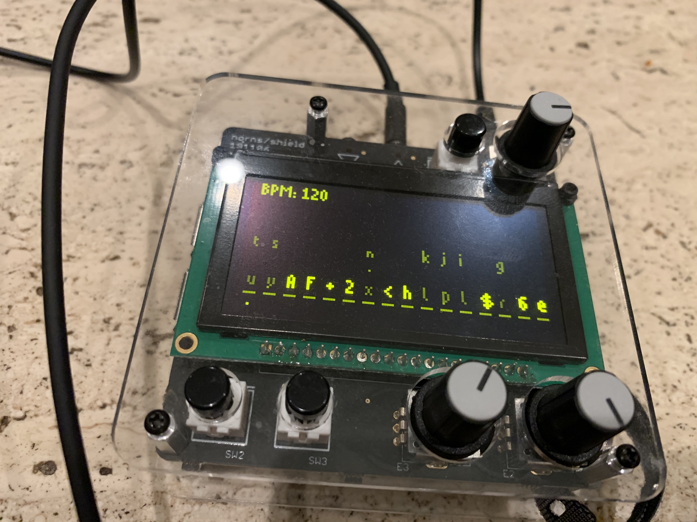

# qfwfq

A simple sequencer for [norns](https://monome.org/docs/norns/) based on the movie notion of a brute force password solver.

## TK

This is ultimately intended for midi and CV via Craw, but in this early stage it's all PolyPerc and compromise. Yolo.

## Apologies

The name comes from the protagonist of t-zero and Cosmicomics by Italo Calvino. It's a name owing to [Oulipo](https://en.wikipedia.org/wiki/Oulipo), which feels meaningful here.